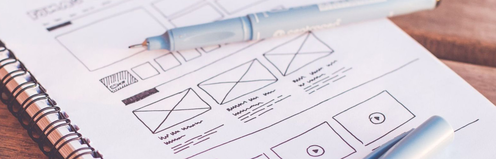

I love designing usable things

⚡ Fun fact:
- 📚 I’m currently learning JavaScript required for FrontEnd development.
- 🙏 I’m looking to collaborate with a gaming developer to make an idea real.
- 📷 Sometimes I  like taking pictures.
-  [Listening to this right now!](https://open.spotify.com/embed/playlist/0pUbvYaeZVB97RDLZK3Wqu "SuperHot Playlist")

	
### Let's Connect	

	
	
	

